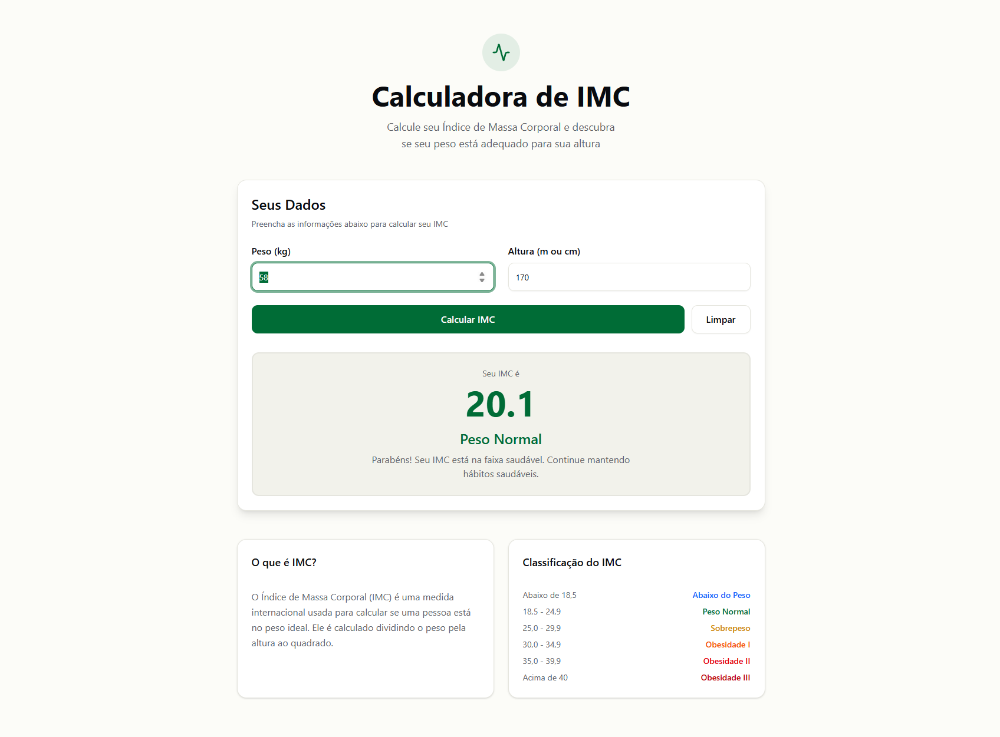
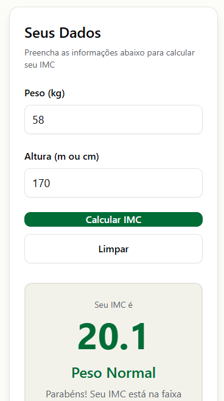

# Calculadora de IMC

> **Acesse o projeto online:** [https://imcacul.vercel.app/](https://imcacul.vercel.app/)

Calculadora de IMC moderna e de alta performance, desenvolvida com o ecossistema de ponta do Next.js 16 e React 19.2. O projeto oferece uma experiência totalmente responsiva, garantindo acessibilidade e fluidez tanto em dispositivos móveis quanto em desktops.

[](https://nextjs.org/blog/next-16)
[](https://react.dev/)
[](https://tailwindcss.com/docs/v4-beta)
[](https://www.typescriptlang.org/)
[](https://postcss.org/)
[](https://lucide.dev/)

## 📱 Preview do Projeto

### Desktop


### Mobile



## 📋 Sobre o Projeto

Esta aplicação web permite que os usuários calculem seu IMC de forma rápida e fácil, inserindo peso e altura. O resultado é apresentado com uma classificação visual colorida que indica a faixa de peso do usuário.

## ✨ Funcionalidades

- **Cálculo automático de IMC** - Digite peso e altura para ver o resultado instantaneamente
- **Suporte para diferentes unidades** - Aceita altura em metros ou centímetros
- **Classificação visual** - Cores distintas para cada faixa de IMC
- **Design responsivo** - Funciona perfeitamente em dispositivos móveis e desktop
- **Interface em português** - Totalmente localizada para o público brasileiro
- **Informações educativas** - Cards explicativos sobre o IMC e suas categorias

## 🎨 Tecnologias Utilizadas

- **Next.js 16** - Framework React com App Router
- **React 19** - Biblioteca JavaScript para interfaces
- **TypeScript** - Tipagem estática para JavaScript
- **Tailwind CSS v4** - Framework CSS utilitário

## 🚀 Como Executar

1. Clone o repositório
```bash
https://github.com/Rodrigopcosta/Calcular-IMC.git
```

2. Instale as dependências:
```bash
npm install
```

3. Execute o servidor de desenvolvimento:
```bash
npm run dev
```

4. Abra [http://localhost:3000](http://localhost:3000) no seu navegador

## 📊 Categorias de IMC

| Faixa de IMC | Classificação |
|--------------|---------------|
| Abaixo de 18.5 | Abaixo do peso |
| 18.5 - 24.9 | Peso normal |
| 25.0 - 29.9 | Sobrepeso |
| 30.0 - 34.9 | Obesidade Grau I |
| 35.0 - 39.9 | Obesidade Grau II |
| 40.0 ou mais | Obesidade Grau III |

## 🎯 Estrutura do Projeto

```
├── .vscode/                # Configurações locais do editor (lint/ui)
├── app/                    # Diretório principal (App Router)
│   ├── globals.css         # Estilos globais e Tailwind v4
│   ├── icon.png            # Favicon oficial do projeto
│   ├── layout.tsx          # Estrutura base da aplicação
│   └── page.tsx            # Página principal da calculadora
├── components/             # Componentes reutilizáveis
│   ├── ui/                 # Componentes de base (design system)
│   └── bmi-calculator.tsx  # Lógica central da calculadora de IMC
├── lib/                    # Funções utilitárias e helpers
├── public/                 # Arquivos estáticos acessíveis via URL
│   └── screenshots/        # Prints de demonstração (Desktop/Mobile)
├── .gitignore              # Definição de arquivos ignorados no Git
├── LICENSE                 # Licença MIT
├── next.config.mjs         # Configurações do Next.js 16
├── package.json            # Dependências e scripts do projeto
└── postcss.config.mjs      # Configuração do motor CSS
```

## 💡 Como Usar a Calculadora

1. Digite seu peso em quilogramas (ex: 70)
2. Digite sua altura em metros (ex: 1.75) ou centímetros (ex: 175)
3. O IMC será calculado automaticamente
4. Veja sua classificação com a cor correspondente
5. Consulte a tabela de referência para mais informações

## 🎨 Personalização

O projeto utiliza design tokens do Tailwind CSS definidos no arquivo `globals.css`. Você pode personalizar as cores, fontes e espaçamentos editando este arquivo.

## 📝 Licença

Este projeto está sob a [Licença MIT](./LICENSE). Sinta-se livre para usar e modificar conforme necessário.

## Autor

- Rodrigo Costa
- Linkdin: (https://www.linkedin.com/in/rodrigopc-developer/)

## 🤝 Contribuições

Contribuições são bem-vindas! Sinta-se à vontade para abrir issues ou enviar pull requests.

## ⚠️ Aviso Importante

Esta calculadora fornece apenas uma estimativa geral. O IMC não considera fatores como massa muscular, densidade óssea, idade e sexo. Consulte sempre um profissional de saúde para uma avaliação completa.
