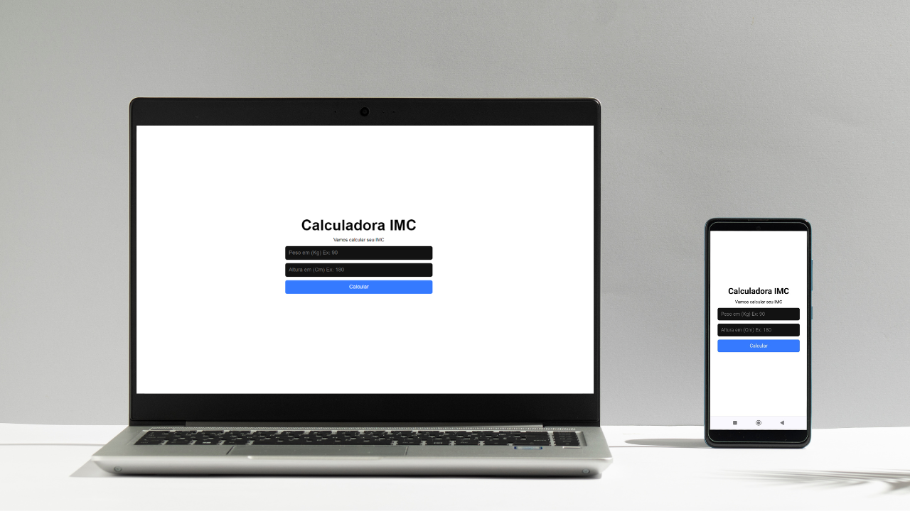

# Calculadora de IMC
[](https://github.com/Rodrigopcosta/Calcular-IMC/blob/main/LICENSE) 

https://imccalculation.netlify.app/

Este é um projeto de uma calculadora de Índice de Massa Corporal (IMC) desenvolvido com React JS e Vite. A calculadora permite que os usuários insiram seu peso e altura para calcular o IMC e exibir a categoria correspondente, como abaixo do peso, peso normal, sobrepeso ou obesidade.

## Funcionalidades

- **Cálculo de IMC**: Insira seu peso em quilogramas e altura em metros para calcular o seu IMC.
- **Classificação do IMC**: Exibe a categoria do IMC com base nos valores calculados.
- **Interface Responsiva**: Design responsivo que se adapta a diferentes tamanhos de tela.
- **Feedback Instantâneo**: Atualização instantânea do resultado ao inserir os valores de peso e altura.

## Tecnologias Utilizadas

- **React JS**: Biblioteca JavaScript para construção de interfaces de usuário.
- **Vite**: Ferramenta de build rápida e leve para projetos frontend.
- **HTML5**: Estruturação do conteúdo da aplicação.
- **CSS3**: Estilização da interface.

## Imagens do Projeto



## Como Executar o Projeto

Para executar este projeto localmente, siga os passos abaixo:

1. **Clone o repositório:**

   ```bash
   git clone https://github.com/seu-usuario/calculadora-imc.git

2. **Navegue até o diretório do projeto:**

   ```bash
   cd calculadora-imc

3. **Instale as dependências:**
     ```bash
   npm install

4. **Execute a aplicação:**
     ```bash
   npm run dev

5. **Abra o navegador e acesse:**
     ```bash
   http://localhost:3000


  Estrutura do Projeto
  ```bash
  java
  Copiar código
  calculadora-imc/
  ├── public/
  │   ├── index.html
  │   └── ...
  ├── src/
  │   ├── components/
  │   │   ├── IMCCalculator.js
  │   │   └── ...
  │   ├── App.js
  │   ├── index.js
  │   └── ...
  ├── .gitignore
  ├── package.json
  ├── README.md
  └── ...
```

## Créditos

Este projeto foi desenvolvido com base em um vídeo tutorial disponível no YouTube. Agradecimentos especiais ao Matheus Fraga do canal Sujeito programador.

## Contribuição

Contribuições são bem-vindas! Sinta-se à vontade para abrir issues e pull requests para melhorar o projeto.
